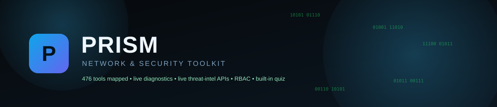
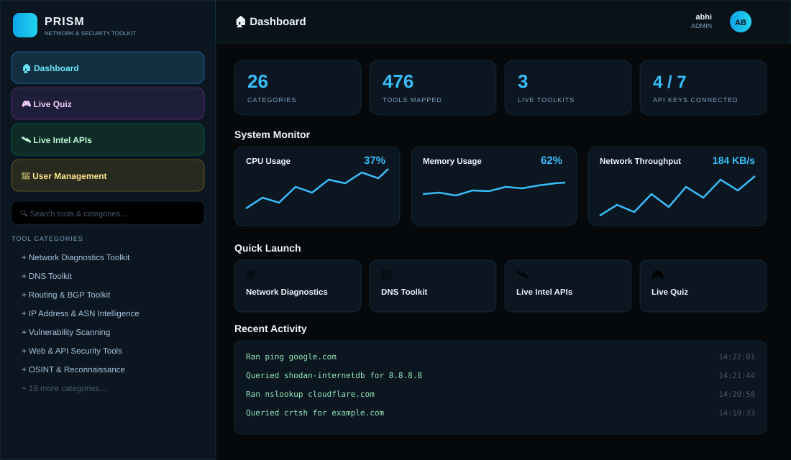
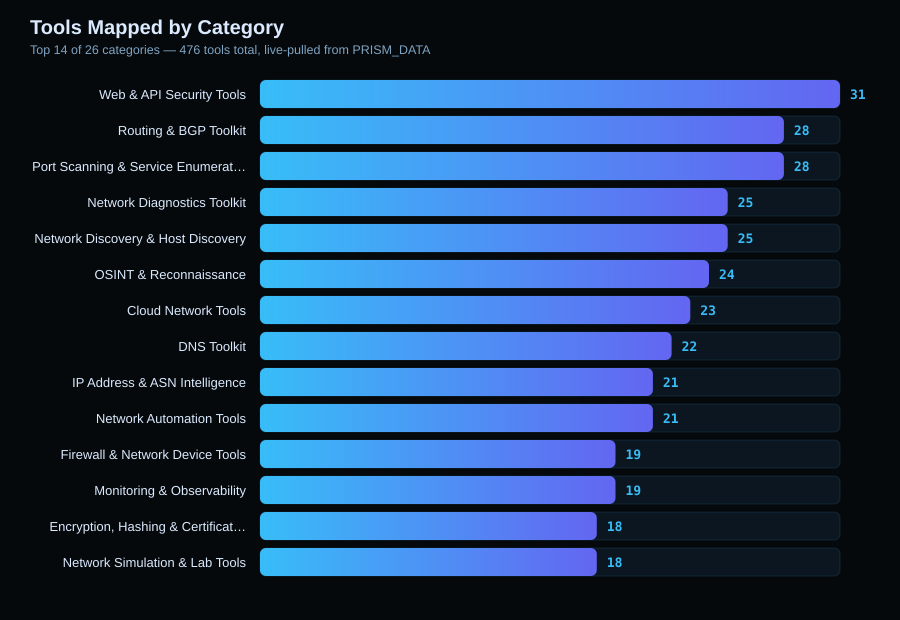
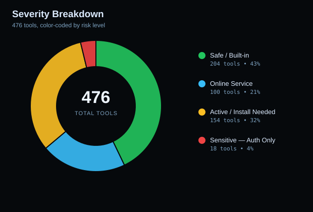
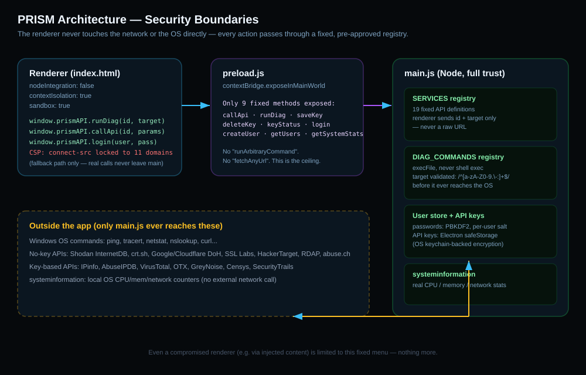

<p align="center">
  
</p>

<p align="center">
  
  
  
  
  
</p>

# PRISM — Network & Security Toolkit

A Windows desktop app that puts an entire network/security engineer's workflow in one place: live diagnostics you can actually run, a categorized map of 476 tools across 26 domains, free threat-intel API integrations, a real-time system monitor, role-based user accounts, and an embedded live MCQ quiz for streaming.

---

## 📸 What it looks like

<p align="center">
  
</p>

<sub>This is a stylized recreation of the actual layout/colors (not a screen capture) — built without a rendering environment on hand, but faithful to the real `index.html`.</sub>

---

## 📊 What's actually inside

<table>
<tr>
<td width="60%">

</td>
<td width="40%">

</td>
</tr>
</table>

<sub>Both charts are generated directly from the app's real `PRISM_DATA` object — not illustrative, actual counts.</sub>

**Severity legend:**

| Color | Meaning |
|---|---|
| 🟢 Safe / Built-in | Passive lookups, built-in OS tools — safe on anything |
| 🔵 Online Service | Free/paid third-party lookup services |
| 🟠 Active / Install Needed | Generates real traffic against a target — authorized use |
| 🔴 Sensitive — Auth. Use Only | Credential/exploitation-class tooling — strictly authorized engagements |

---

## 🧩 Core features

- **🌐 Live Network Diagnostics** — ping, tracert, pathping, arp, netstat, nslookup, curl, and more, run directly from the app
- **🔎 Live DNS Toolkit** — real DNS resolution plus reference links for enumeration/intel tools
- **🛰️ Live Intel APIs** — 12 no-key lookups (Shodan InternetDB, crt.sh, DNS-over-HTTPS, SSL Labs, HackerTarget, RDAP, abuse.ch) + 7 free-tier API integrations (IPinfo, AbuseIPDB, VirusTotal, OTX, GreyNoise, Censys, SecurityTrails)
- **📈 Live System Monitor** — real CPU / memory / network throughput charts on the dashboard, powered by `systeminformation`
- **👥 User accounts + RBAC** — admin / analyst / viewer roles, local accounts with photo avatars, PBKDF2-hashed passwords
- **🎮 Embedded live quiz** — "The CyberSecurity Guy" MCQ, full-screen capable, for streaming/practice
- **📚 476 tools mapped** across 26 categories — every reference tool color-coded and linked where a verified official source exists

---

## 🏗️ Architecture

<p align="center">
  
</p>

The short version: the renderer (the actual web page you see) can **never** send an arbitrary URL or shell command anywhere. It can only ask the Electron main process to run one of a fixed, pre-approved set of diagnostics or API lookups by ID — the main process builds the real command/request itself. Even in a worst-case scenario where the page's JS were ever compromised, this is the hard ceiling on what it could do.

---

## ⚙️ Requirements

- [Node.js](https://nodejs.org) (LTS version)
- Windows, for the packaged `.exe` (the diagnostic commands are written for Windows specifically; the app itself is cross-platform Electron)

## 🚀 Setup

```bash
git clone https://github.com/YOUR-USERNAME/YOUR-REPO-NAME.git
cd YOUR-REPO-NAME
npm install
```

## ▶️ Run it

```bash
npm start
```

First launch prompts you to create the admin account. Every launch after that requires signing in.

## 📦 Build a distributable `.exe`

```bash
npm run dist
```

Output lands in `dist/` as a portable `.exe` — no installer needed, just double-click to run.

---

## 🗂️ Project structure

```
main.js       — Electron entry point: window creation, IPC handlers,
                the API service registry, diagnostic command execution,
                user management, and system stats
preload.js    — the narrow, safe bridge exposed to the page (window.prismAPI)
index.html    — the entire PRISM UI (sidebar, dashboard, all tool panels)
quiz.html     — the embedded live quiz, loaded in an iframe from index.html
assets/       — README images (this file's charts and diagrams)
package.json  — dependencies + electron-builder config
```

---

## 🔒 Security notes

- API keys are encrypted at rest via Electron's `safeStorage` (OS keychain-backed) — never stored in plaintext, never exposed to the page.
- User passwords are hashed with PBKDF2 (100,000 iterations, per-user salt) — never stored in plaintext.
- All API calls and system commands are dispatched from the Electron **main process** through a fixed, pre-approved registry — the renderer can never send an arbitrary URL or shell command, only a known service/command ID plus a validated target.
- Diagnostic command targets are validated against a strict hostname/IP pattern before ever reaching `execFile` — no shell interpolation, so command injection isn't possible through this input.
- Content-Security-Policy locks `connect-src` to the 11 specific no-key API domains as a defense-in-depth fallback for the browser-preview path; the production (Electron) path never needs the page itself to make network requests at all.

---

## 📄 License

See [`LICENSE.txt`](./LICENSE.txt). Source visible for portfolio/demo purposes — not licensed for reuse without permission.
